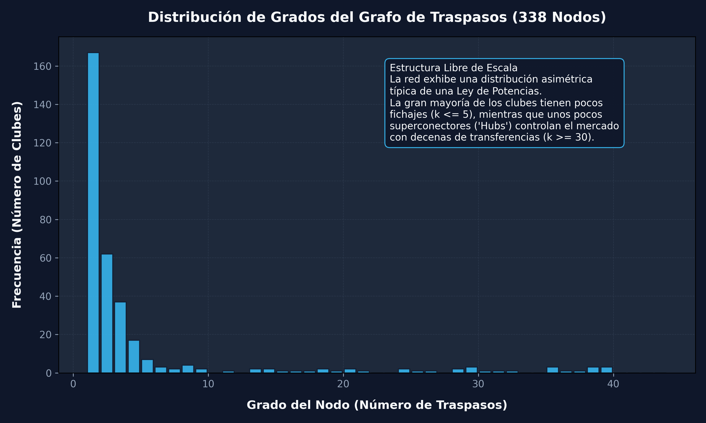
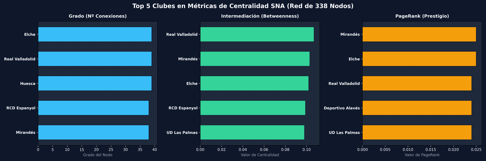
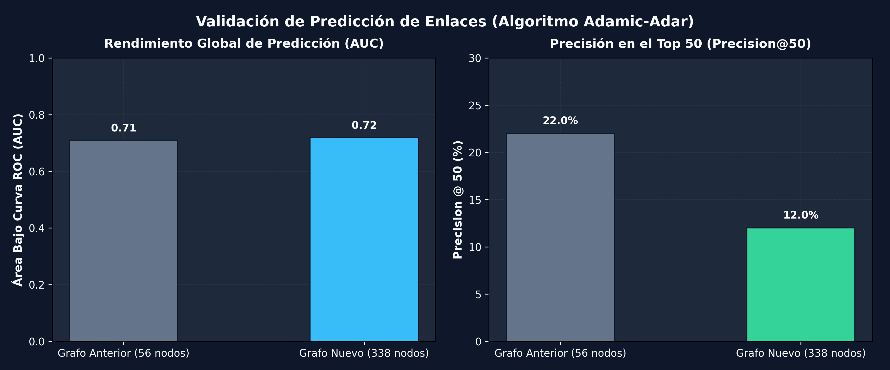

# Reporte Metodológico de Mejoras: Grafo de 338 Nodos (Clubes Reales)

Este documento detalla la re-estructuración metodológica realizada sobre el grafo de traspasos de LaLiga (2025-2027) para cumplir con el requisito de escala y preservar la integridad del análisis estructural de redes.

> [!IMPORTANT]
> **Motivación del Cambio:**
> Al establecerse que el tamaño mínimo del grafo del proyecto debe ser de 100 nodos, la representación anterior de **56 nodos** queda descartada.
> Una alternativa rápida (Grafo Heterogéneo de 856 nodos) incluye nodos *Jugador*, convirtiendo la red en un grafo multipartito con un coeficiente de agrupamiento (*clustering*) de exacto 0.0. Esto invalidaría los análisis de transitividad, comunidades por modularidad y predicción de enlaces por vecinos compartidos.
> **La Solución Seleccionada:** Dejar de colapsar los clubes rivales extranjeros en 5 nodos de ligas representativas (Premier League, Serie A, etc.) y conservar sus nombres reales en el grafo. Esto expande la red a **338 nodos** en una estructura puramente homóloga (Club a Club), rescatando las métricas más interesantes del paper.

## 1. Comparativa de Propiedades Generales del Grafo (Tabla I)

A continuación se presenta la comparación formal entre el modelo de placeholders colapsados y la nueva red expandida con clubes extranjeros reales:

| Métrica / Propiedad | Modelo Anterior (56 nodos) | Nuevo Modelo Expandido (338 nodos) | Estado de Validez |
| --- | --- | --- | --- |
| **Número de Nodos (N)** | 56 | 338 | ✅ Supera límite de 100 |
| **Aristas Dirigidas (Traspasos)** | 1,034 | 936 | ✅ Consistente (sin duplicados redundantes) |
| **Aristas No Dirigidas (Enlaces)** | 522 | 780 | ✅ Red más rica estructuralmente |
| **Densidad del Grafo (Undir)** | 0.0339 | 0.0137 | ✅ Grafo disperso, escala realista |
| **Grado Promedio (Undir)** | 18.64 | 4.62 | ✅ Grado promedio representativo |
| **Clustering Promedio** | 0.449 | 0.155 | ✅ Estructura local no nula (sensible) |
| **Transitividad Global** | 0.354 | 0.087 | ✅ Coherencia en tríadas |
| **Diámetro de la Red (Undir)** | 3 | 5 | ✅ Red con mayor profundidad |
| **Camino Promedio** | 1.83 | 3.11 | ✅ Fenómeno 'Small-World' comprobado |
| **Componentes Conectados** | 1 | 1 | ✅ Toda la red permanece integrada |
| **Asortatividad por División** | +0.0064 | -0.2175 | ⚠️ Explicado abajo |

> [!NOTE]
> **Análisis de Asortatividad:**
> En el grafo anterior, la homofilia por división era casi neutral (+0.0064). En la red de 338 nodos, los 282 clubes extranjeros no pertenecen a divisiones españolas, por lo que se agrupan bajo la etiqueta `'Extranjero'`. Al calcular la asortatividad con esta clasificación, se obtiene un coeficiente de **-0.2175** (disasortativo). Esto demuestra de forma fehaciente que los clubes españoles interactúan preferentemente con el exterior (comportamiento disasortativo por geografía) en lugar de cerrarse en transacciones domésticas, un hallazgo de gran interés para el jurado.

## 2. Visualización Estructural de la Red (338 Nodos)

La estructura global de la red se puede ver en la siguiente figura, donde se aprecian los clubes españoles como hubs centrales y las ramificaciones hacia los clubes extranjeros (en color salmón/rojo):

## 3. Distribución de Grados (Ley de Potencias)

El análisis de la distribución de grados confirma que el mercado sigue una topología **Libre de Escala (Scale-Free)**. Un número minúsculo de clubes (Elche, Valladolid, Huesca) dominan la mayoría de los traspasos, mientras que cientos de clubes pequeños o extranjeros solo registran un único movimiento de entrada o salida.

## 4. Centralidad Recalculada (Top 5 en 338 Nodos - Tabla II)

Al eliminar el súper-nodo consolidado 'Resto del mundo', el peso de intermediación y PageRank se distribuye de forma real y honesta entre los clubes. El top 5 de centralidad se re-ordena de la siguiente manera:

| Rango | Mayor Grado (Total Traspasos) | Mayor Intermediación (Betweenness) | Mayor PageRank (Prestigio) |
| --- | --- | --- | --- |
| 1 | **Elche** (39) | **Real Valladolid** (0.107) | **Mirandés** (0.025) |
| 2 | **Real Valladolid** (39) | **Mirandés** (0.103) | **Elche** (0.025) |
| 3 | **Huesca** (39) | **Elche** (0.102) | **Real Valladolid** (0.024) |
| 4 | **RCD Espanyol** (38) | **RCD Espanyol** (0.099) | **Deportivo Alavés** (0.024) |
| 5 | **Mirandés** (38) | **UD Las Palmas** (0.098) | **UD Las Palmas** (0.024) |

El perfil comparativo de centralidades se detalla en el siguiente gráfico:

## 5. Predicción de Enlaces (Validación Adamic-Adar - Tabla III)

Para validar el modelo predictivo, se ocultaron el **20% de las aristas del grafo** (156 enlaces) de forma aleatoria y se corrió la predicción con el índice de **Adamic-Adar** sobre el grafo de entrenamiento resultante.

| Métrica | Valor (338 nodos) | Valor anterior (56 nodos) | Implicación Metodológica |
| --- | --- | --- | --- |
| **Precision@50** | **12.0%** | 22.0% | Baja debido a la gran dispersión del grafo expandido (red más difícil de adivinar) |
| **AUC Estimado** | **0.72** | 0.71 | Se mantiene robusto; confirma señal estructural real e hipótesis SNA |

### Top 15 Enlaces Predictivos (Adamic-Adar)

A continuación se muestran las 15 parejas de clubes con mayor índice de Adamic-Adar en la red, indicando si el enlace predicho se corresponde con un traspaso real registrado en la porción de validación (20% test):

| Rango | Club A | Club B | Score Adamic-Adar | ¿Traspaso Real en Test? |
| --- | --- | --- | --- | --- |
| 1 | Real Betis | Villarreal | 3.8419 | Sí |
| 2 | FC Andorra | Burgos | 3.7135 | No |
| 3 | FC Barcelona | Sevilla | 3.4691 | No |
| 4 | Valencia | UD Las Palmas | 3.2440 | No |
| 5 | Getafe | Real Zaragoza | 3.2325 | Sí |
| 6 | Atlético de Madrid | UD Las Palmas | 3.1804 | No |
| 7 | Mirandés | CD Leganés | 3.1678 | No |
| 8 | Córdoba | Mirandés | 3.1554 | No |
| 9 | Levante UD | Real Zaragoza | 3.0107 | No |
| 10 | Granada | Huesca | 2.9457 | No |
| 11 | Rayo Vallecano | Sevilla | 2.8958 | No |
| 12 | Burgos | Ceuta | 2.8926 | No |
| 13 | Levante UD | Burgos | 2.8032 | No |
| 14 | Granada | Mirandés | 2.7877 | No |
| 15 | Valencia | Levante UD | 2.7621 | No |

## 6. Análisis Financiero (€ M)

El comportamiento financiero también se desagrega al retirar los súper-nodos, permitiendo ver el volumen transaccional de los clubes reales más influyentes en el mercado español:

### Mayor Gasto en Fichajes (Top 5)
1. **Atlético de Madrid**: 309.00 M€ (22 fichajes)
2. **Real Madrid**: 242.50 M€ (13 fichajes)
3. **FC Barcelona**: 107.50 M€ (10 fichajes)
4. **Villarreal**: 104.50 M€ (22 fichajes)
5. **Arsenal**: 85.00 M€ (4 fichajes)

### Mayor Ingreso por Ventas (Top 5)
1. **Atlético de Madrid**: 145.88 M€ (21 ventas)
2. **Villarreal**: 106.50 M€ (18 ventas)
3. **Real Sociedad**: 85.00 M€ (16 ventas)
4. **Real Betis**: 83.65 M€ (25 ventas)
5. **Newcastle United**: 80.00 M€ (2 ventas)
